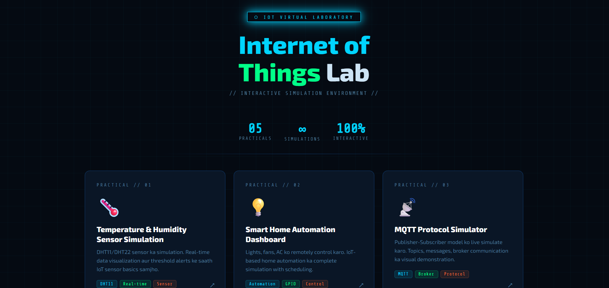

# 📡 IoT Virtual Lab

## 🧾 Description

**IoT Virtual Lab** is a browser-based simulation platform that allows users to explore and experiment with Internet of Things (IoT) concepts without requiring any physical hardware. All simulations run directly in the browser, making it accessible, fast, and easy to use for students, educators, and developers.

* * *

## 🚀 Features

-   🌐 100% browser-based simulations
-   ⚡ No hardware required
-   🧪 Interactive IoT experiments
-   📱 Responsive and user-friendly interface
-   🎯 Ideal for learning and prototyping

* * *

## 📸 Preview

  

* * *

## 📂 Project Structure

IoT-Virtual-Lab/  
│── index.html  
│── assets/  
│   └── preview.png  
│── README.md

* * *

## 🛠️ Technologies Used

-   HTML5
-   CSS3
-   JavaScript

* * *

## 📦 Installation & Usage

1.  Clone the repository:
    
    git clone https://github.com/your-username/iot-virtual-lab.git
    
2.  Open the project folder:
    
    cd iot-virtual-lab
    
3.  Run the project:
    -   Open `index.html` in your browser

* * *

## 🎯 Use Cases

-   Learning IoT concepts
-   Academic projects
-   Virtual lab demonstrations
-   Quick prototyping without hardware

* * *

## 👨‍💻 Author

**Yash Jain**

* * *

## 📄 License

This project is open-source and available under the MIT License.
